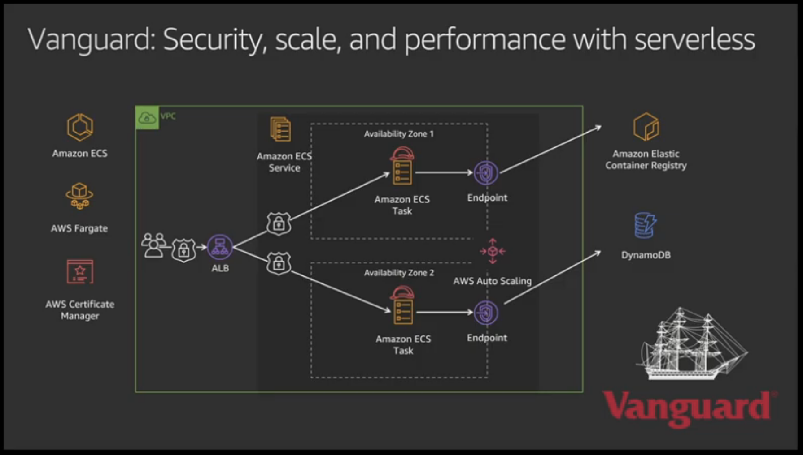

# CON213 - Using Containers & Serverless to Accelerate Application Development

* Building blocks = shared, commonly used resources that each team has found themselves re-inventing each time.

* Value of building blocks:
	1. Reduce work to solve common problems
	2. Find innonative answers to hard problems
	3. Exposing best practices

* Building modern applications
	1. Software delivery
		* Pipeline per team / service
		* Pipeline:
			1. Build app
			2. Unit test
			3. Package deploy
			4. Integration test
			5. Push
		* "Fractional" / "Progressive Delivery"
			* Incrementally track progress of release / status for safe deployment
				* Deploy to perhaps one availability zone
		* Infrastructure and application
			* Cloud resources and application
			* Common code review process
			* Deployed as a package
		* Application-first deployment
			* Understands code packaging
			* Choreographs configuration
			* Monitors progress
		* Amazon CLI 2.0 -> helpful for managing deployments
			* Based off of Amazon CDK. Can define and configure ECS infrastructure on the command line
		* AWS SAM Start Right
			* SAM is like CDK, package infrastructure as templates (databases, etc...)
			* "Serverless Application Manager"
	2. Operational model
		* What customers want
			* Build applications, not infra
			* Scale quickly and seamlessly
			* Security and isolation by design
		* AWS operational respobility model
			* Balance between giving customers powerful tools and not making them too complex
		* Cluster huggers are the new server huggers
		* Essential complexity and accidental complexity:
			* Essential complexity is unavoidable and characteristic of the problem being solved at hand
			* Accidental complexity - unecessary, and should be reduced as close to zero as posssible
		* Application should guide infrastructure
		* Application-first with Amazon ECS capacity providers
			1. Amazon EC2 Spot
			2. Amazon EC2 On-Demand
			* Now ability to mix capacity providers
		* Vanguard example:
	
		
		
	3. Architecture patterns
